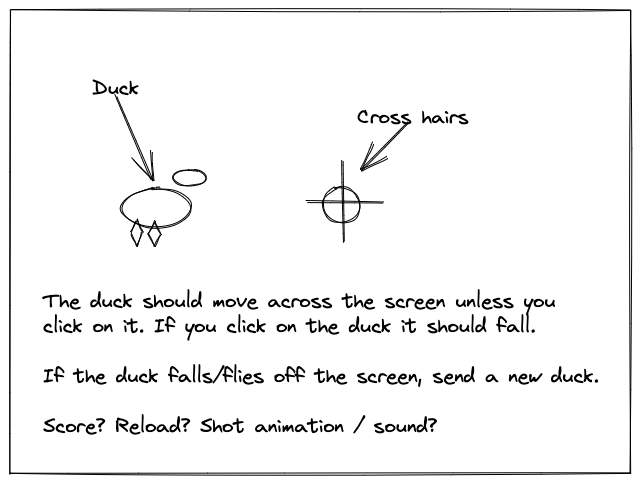

# 08 - P5JS Duck Hunt



## Instructions:

Read through the code but do not edit anything yet. Discuss the `setup` function with your partner.  

> How wide is the canvas?  
> How tall is the canvas?  
> What code is new? What does it do?

Next look at the definition of the `drawDuck` function. DO NOT EDIT THIS FUNCTION.

> How many parameters does it require?  
> What code is new? What does it do?  

Finally, find the TODO comments in `script.js`. Read them carefully and discuss with your partner. Then add the appropriate code just below the comments. 

TODO #7 and larger are challenges and should not be completed near those comments, they are just ideas of where you could take the project next.

After each TODO is complete, you should be able to test your program.

```javascript
//TODO #1 call the drawDuck function

// TODO #2 Draw cross hairs around the mouse 
//    (two lines through and a circle around)

//TODO #3 Declare and initialize a duckX variable 

//TODO #3 Declare and initialize a duckY variable

// Code to move the duck
// TODO #4 Write a Conditional statement so 
// that if the duck is alive, it "Flies" 
//                - moves up and across

// TODO #4 Otherwise the duck should move 
// straight down only
// Also assign up variable the value of 0
// this will make the wings stop flapping

// TODO #5 Make the duck re-appear
// Write a conditional statement so that 
// if the duck is too high or too low (off canvas), 
// it respawns to the bottom center of the canvas

  // TODO #6 Write conditional statement or statements
// that represents whether the mouse position
// is over the duck body.
// You can nest if statements or use the && operator

// TODO #7 Implement a score system
// TODO #8 Make the difficulty increase as the score increases
// TODO #9+ Sound? Reload? Dog? More ducks?
    
```